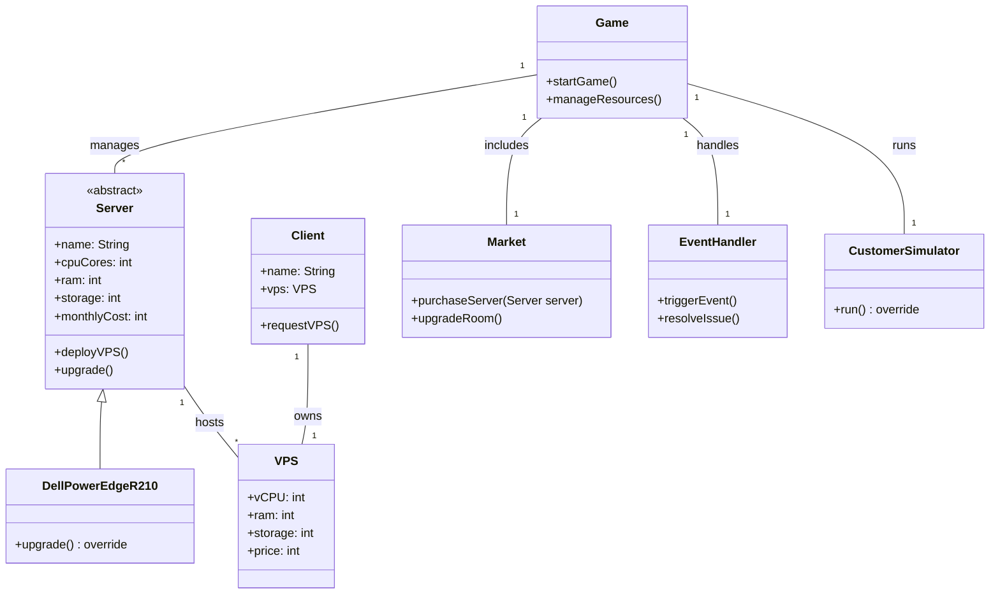

# Table of Contents

- [How Contribute by Nong Claude Kung](#how-contribute-by-nong-claude-kung)
- [VPS Tycoon - Game Development Guide](#vps-tycoon---game-development-guide)
    - [โครงสร้างโปรเจค](#โครงสร้างโปรเจค)
    - [แนวทางการพัฒนา](#แนวทางการพัฒนา)
    - [Tips สำหรับมือใหม่](#tips-สำหรับมือใหม่)
- [ลายละเอียดเกม](#ลายละเอียดเกม)
    - [1) ภาพรวม (Game Overview)](#1-ภาพรวม-game-overview)
    - [2) การตั้งค่าเริ่มต้น (Starting Conditions)](#2-การตั้งค่าเริ่มต้น-starting-conditions)
    - [3) โครงสร้างของเกม (Game Structure)](#3-โครงสร้างของเกม-game-structure)
    - [4) ระบบเซิร์ฟเวอร์ (Server System)](#4-ระบบเซิร์ฟเวอร์-server-system)
    - [5) ระบบมัลติเธรด (Multithreading System)](#5-ระบบมัลติเธรด-multithreading-system)
    - [6) แผนผังคลาส (Class Diagram - Java)](#6-แผนผังคลาส-class-diagram---java)
- [ToDo](#todo)
- [Intellij Install](#intellij-install)

# How Contribute by Nong Claude Kung :
# VPS Tycoon - Game Development Guide

## โครงสร้างโปรเจค

โปรเจคนี้เป็นเกม Tycoon ที่พัฒนาด้วย JavaFX แบ่งเป็นแพ็คเกจหลักๆ ดังนี้:

### 1. com.vpstycoon
- `GameApplication.java` - คลาสหลักที่เริ่มต้นเกม จัดการ navigation ระหว่างหน้าต่างๆ

### 2. com.vpstycoon.config
- จัดการการตั้งค่าเกม เช่น ความละเอียดหน้าจอ, เสียง
- ใช้ Jackson สำหรับ serialize/deserialize ข้อมูล

### 3. com.vpstycoon.game
- ตัวเกมหลัก จัดการ game state และ objects ในเกม
- `GameManager.java` - จัดการสถานะเกม การเซฟ/โหลด
- `GameObject.java` - คลาสพื้นฐานสำหรับวัตถุในเกม

### 4. com.vpstycoon.ui
- ส่วน UI ทั้งหมด แบ่งเป็น:
  - menu/ - หน้าเมนูต่างๆ
  - settings/ - หน้าตั้งค่า
  - game/ - หน้าเล่นเกม

### 5. com.vpstycoon.event
- ระบบ Event Bus สำหรับการสื่อสารระหว่างคอมโพเนนต์

### 6. com.vpstycoon.audio
- จัดการเสียงเพลงและเอฟเฟค

## แนวทางการพัฒนา

1. **Model-View Pattern**
   - แยก logic ออกจาก UI ชัดเจน
   - ใช้ Properties และ Bindings ของ JavaFX

2. **Event-Driven Architecture**
   - ใช้ EventBus ลดการ coupling
   - แยก concerns ด้วย event handlers

3. **Config Management**
   - ใช้ JSON สำหรับบันทึกการตั้งค่า
   - รองรับการ hot-reload

4. **Resource Management**
   - จัดการ assets (ภาพ, เสียง) แบบ lazy loading
   - มีระบบ cache

## Tips สำหรับมือใหม่

1. เริ่มจากการทำความเข้าใจ `GameApplication.java`
2. ศึกษาการทำงานของ UI ใน package ui/
3. ดูตัวอย่างการสร้าง GameObject ใน game/
4. ทดลองเพิ่ม features ใหม่โดยดู pattern จากโค้ดที่มีอยู่

# ลายละเอียดเกม Flow game เจาะลึกมากขึ้น
---
## Main menu : New game, Continue , Setting ,Exit
    -New game สร้างเซฟเกมใหม่ ***หากมีเซฟแล้วต้องถาม For sure?***
    -Continue เล่นเกมต่อ ***หากไม่มีเซฟแล้วต้องแจ้งไป New game***
    -Setting Set Resolotion , Music , Credit , Tutorial คลิก
    -Exit ออกเกม
---

## Game play
---
### Development Points (แต้มการพัฒนา)
    แต้มการพัฒนา (Development Points) สามารถแบ่งการใช้งานออกเป็น 4 หมวดหลัก:
    -🔴 Deploy
    ลดเวลาการ Deploy VPS
    ปลดล็อค ระบบปฏิบัติการใหม่ๆ
    ได้รับ : ระหว่างการ Opitmize
    -🔵 Network
    เพิ่ม Bandwidth
    ลด Network Congestion (ป้องกันเครือข่ายหนาแน่น)
    ได้รับ : ระหว่างการปล่อยเช่า Vps
    -🟣 Security (ความปลอดภัย)
    ลดโอกาส Data Breach
    เพิ่มตัวเลือก Firewall ป้องกันการแฮ็กมากขึ้น
    ได้รับ : ระหว่างการแก้ไขปัญหาที่เข้ามา
    -🟢 Marketing (การตลาด)
    เพิ่มช่องทางการตลาด
    เพิ่มโอกาสได้รับ Rating สูงขึ้น
    เพิ่มจำนวน Request ที่ได้รับ
    ได้รับ : หลังการโปรโมท

### Tutorial สอนวิธีการเล่น (สอนรอบเดียวแค่ New game)
#### Two Options
    -สไลด์ Show รูปภาพวิธีเล่นให้ผู้เล่นเลื่อนเอง
    -Event คลิกเพื่อไปต่อ

### กดตัวคอมพิวเตอร์ขึ้น Interface Desktops

#### Chat
    -ดู Request ลูกค้า แสดง Rating ของบริษัทมุมบน
    -Request Chat มีเพดาห์ Level ที่ต้องปลดโดยใช้แต้ม Marketing
    -Level Chat ที่ต้องปลดเพื่อ รับลูกค้ามากขึ้น ประเภทลูกค้าดีขึ้น ความยากRequestที่ยากขึ้น อัพเกรด

#### ประเภทลูกค้า ระดับลูกค้า
    -ลูกค้าบุคคลทั่วไป , ลูกค้าบริษัทเล็ก กลาง ใหญ่
    -งานที่ Request ยากขึ้นต้อง Optimize Vps ให้ดีเหมาะกับประเภทงาน
    -ประเภทงานที่เน้นความเร็ว ปลอดภัย รองรับความเสถียร
    -Maketing Point เพิ่ม หาก 1. Rating ที่ได้ลูกค้าเยอะหลังสรุป 2. เพิ่มจากการที่รับลูกค้าแต่ละประเภท ได้ Point ต่างกัน

#### หลังรับงาน Request 
##### เฟส 1 การเตรียมเครื่องให้ลูกค้า Optimize เตรียม 5 ด้าน
    มีตัวเลือกให้ผู้เล่นเลือกเลย แล้วปลดล็อคจากค่า Point ด้าน Seculity Deploy หรือ การซื้อ
    -OS เลือกระบบปฏิบัติการให้เหมาะสมกับประเภทงาน มีคำอธิบายสั้นแนะนำ
    -Security เกี่ยวกับ Firewall การเข้ารหัสป้องกัน
    -Performance Tuning ทำให้ Vps เร็วขึ้น เสถียร
    -Back up & Restore การเก็บข้อมูล
    -Monitoring & Alerts
    ทุกตัวเลือกมีแบบไม่เลือกก็ได้เพื่อประหยัดงบ ยกเว้น OS
    Opitimize ดีถูกใจรับ Deploy

##### เฟส 2 รัน Event การใช้งานเครื่อง Vps ของลูกค้า
    -ถ้า Opitimize มาเหมาะกับงานและดี จะป้องกันให้เกิด Event บัคน้อยลง
    -ถ้า Optimize มาน้อยหรือไม่เหมาะกับงานอาจเกิดบัคบ่อย
    -เมื่อเกิดบัค ระหว่างนั้นจะไม่ได้เงิน ต้องเข้าช่วงซ่อมระบบ
    -หากระหว่างการใช้งานเกิดบัคบ่อยส่งผลต่อ Rating
    -ระหว่างการใช้ลูกค้าค่า Point Security Network
    ***Event ที่เกิดได้ตามการ Opitimize***
    🛑 Data Breach – ข้อมูลรั่วไหลหากไม่มี Firewall ส่งผลให้ลูกค้าให้คะแนนต่ำลง ต้องติดตั้ง Firewall และอัปเกรด Security

    ⚡ ไฟดับ – เกิดขึ้นหากไม่มี UPS ทำให้ VPS ดับชั่วคราว ลูกค้าอาจยกเลิกบริการ ต้องซื้อ UPS หรือย้ายไป Co-location

    🌐 Network Congestion – ลูกค้ามากเกินไปทำให้ VPS ช้า ต้องอัปเกรด Bandwidth หรือ Load Balancer

    🛠️ ฮาร์ดแวร์พัง – เกิดขึ้นจากการใช้งานหนัก VPS ในเครื่องได้รับผลกระทบ ต้องซื้อเซิร์ฟเวอร์ใหม่หรือใช้ Backup

    💰 ลูกค้าร้องเรียนเรื่องราคา – ตั้งราคาสูงเกินไป อาจทำให้ลูกค้าหาย ต้องลดราคาหรือเพิ่มโปรโมชั่น

    🦠 การโจมตี DDoS – ทำให้เซิร์ฟเวอร์โหลดสูง อาจล่ม ต้องติดตั้ง DDoS Protection และ Load Balancer

    📉 การแข่งขันจากคู่แข่ง – มีคู่แข่งเสนอราคาถูกกว่า ทำให้ลูกค้าหาย ต้องอัปเกรดบริการหรือทำการตลาดเพิ่ม

    📦 ขาดสต็อก IP – IP Address ไม่พอ ลูกค้าต้องรอ ต้องซื้อ IP Block เพิ่ม

    🔄 ระบบทำงานผิดพลาด – Bug หรือ Glitch ทำให้ VPS ล่ม ต้อง Rollback ระบบหรืออัปเดตแพตช์แก้ไข

    🎉 โอกาสพิเศษ – ได้รับรีวิวดี ลูกค้าเพิ่มขึ้น หรือได้ส่วนลดจาก Market

    📍 การจัดการเหตุการณ์สุ่ม

    แจ้งเตือนใน Dashboard ให้ผู้เล่นเลือกแก้ไขปัญหา
    เหตุการณ์ต้องใช้เวลาต่างกันตาม Opitimize (ซ่อมฮาร์ดแวร์)

##### เฟส 3 สรุปผล
    -ค่า Point ที่ได้ทั้งหมด Market Deploy Security Network
    -ค่า Rating คำนวณจากบัค , ความเร็ว
    -Market คำนวณจาก Rating
---
### Interface Desktops Market
##### ระบบตลาด upgrade

## Intellij Install
---

### กรณี download javaFX มาเองในเครื่อง

- ใส่ใน `VM OPTION` 
- ที่ `Run > Edit Configurations...` 
- กด `Modifly options...`

  ```
  --module-path "C:\javafx-sdk-23.0.2\lib" --add-modules javafx.controls,javafx.fxml
  ```
---

---

## **1) ภาพรวม (Game Overview)**

### **แนวเกม:**

- เกมแนว **Tycoon** ที่ให้ผู้เล่นบริหารธุรกิจ **VPS Hosting** ด้วยรูปแบบที่เข้าใจง่าย

### **เป้าหมายของเกม:**

1. **บริหารเซิร์ฟเวอร์**: ซื้อ, อัปเกรด, ดูแลเซิร์ฟเวอร์เพื่อรองรับลูกค้า VPS
2. **จัดการการเงิน**: รักษาสภาพคล่องทางการเงิน และทำกำไรให้ได้
3. **แก้ปัญหาแบบ Real-time**: เผชิญปัญหาสุ่ม เช่น Data Breach, VM Crash
4. **ขยายธุรกิจ**: อัปเกรดห้อง, ติดตั้ง Firewall, Router เพื่อรองรับลูกค้ารายใหญ่

### **กลไกหลักของเกม:**

- **การบริหารทรัพยากร**: วางแผนซื้อ/อัปเกรดเซิร์ฟเวอร์ และจัดการค่าใช้จ่าย
- **การตั้งค่า VPS Plans**: กำหนดแพ็กเกจ VPS เพื่อให้เหมาะสมกับตลาด
- **เหตุการณ์สุ่ม (Random Events)**: สร้างความท้าทายให้ผู้เล่น
- **การพัฒนาและขยายธุรกิจ**: ลงทุนเพิ่ม Firewall, Router, และอัปเกรดห้อง Server

---

## **2) การตั้งค่าเริ่มต้น (Starting Conditions)**

- **เงินเริ่มต้น**: 100,000 THB
- **เซิร์ฟเวอร์เริ่มต้น**: Dell PowerEdge R210 (4 Cores, 16GB RAM, 500GB HDD)
- **Overhead Cost**: 5,000 THB/เดือน (ค่าดำเนินการคงที่)
- **รอบเวลาในเกม**: 1 เดือน = 15 นาทีในเกม

---

## **3) โครงสร้างของเกม (Game Structure)**

### **3.1) เมนูหลัก (Main Menu)**

- **เริ่มเกมใหม่** (Start New Game)
- **โหลดเกม** (Load Game)
- **ตั้งค่าเกม** (Settings)
- **ออกจากเกม** (Exit)

### **3.2) ส่วนหลักของเกม**

1. **Dashboard**: แสดงข้อมูลภาพรวมของธุรกิจ (รายได้, ค่าใช้จ่าย, ความพึงพอใจของลูกค้า)
2. **Server Room**: จัดการ Rack Server (ซื้อ/อัปเกรด/ดูแล)
3. **Market**: ซื้ออุปกรณ์เพิ่มเติม เช่น Firewall, Router, อัปเกรดห้อง Server
4. **Client Management**: ดูคำสั่งซื้อ VPS จากลูกค้า และกำหนด VPS ให้พวกเขา
5. **Event Handling**: ระบบแจ้งเตือนปัญหาสุ่ม เช่น การโจมตีจาก Hacker, Server ล่ม

---

## **4) ระบบเซิร์ฟเวอร์ (Server System)**

### **ตารางเซิร์ฟเวอร์**

|**ชื่อเซิร์ฟเวอร์**|**ราคาซื้อ (บาท)**|**ค่าใช้จ่ายรายเดือน (บาท)**|**CPU Cores**|**RAM (GB)**|**Storage**|**Network Port**|
|---|---|---|---|---|---|---|
|Dell PowerEdge R210|20,000|2,000|4|16|500GB HDD|1 Gbps (Shared)|
|Dell PowerEdge R310|35,000|3,000|6|32|1TB HDD|1 Gbps (Shared)|
|Dell PowerEdge R410|50,000|4,000|8|64|1TB SSD|1 Gbps (Shared)|

---

## **5) ระบบมัลติเธรด (Multithreading System)**

### **การใช้งาน Multithreading ในเกม**

- **CustomerSimulator (Thread)**: จำลองลูกค้าที่สั่งซื้อ VPS
- **ServerMonitor (Thread)**: ตรวจสอบสถานะเซิร์ฟเวอร์และแจ้งเตือนปัญหา
- **EventProcessor (Thread)**: จัดการเหตุการณ์สุ่ม เช่น DDoS, ไฟดับ

### **ตัวอย่างโค้ด Multithreading**

```java
class CustomerSimulator extends Thread {
    public void run() {
        while (true) {
            System.out.println("ลูกค้าใหม่ขอเช่า VPS...");
            try {
                Thread.sleep(10000);
            } catch (InterruptedException e) {
                e.printStackTrace();
            }
        }
    }
}
```

---

## **6) แผนผังคลาส (Class Diagram - Java)**



---

## ToDo
- [x] Main Menu
- [x] Pause Menu
    - [x] New Game btn
    - [x] Resume btn
- [x] Setting Screen
    - [x] Resolution
    - [x] Fullscreen 
- [x] Empty Screen


