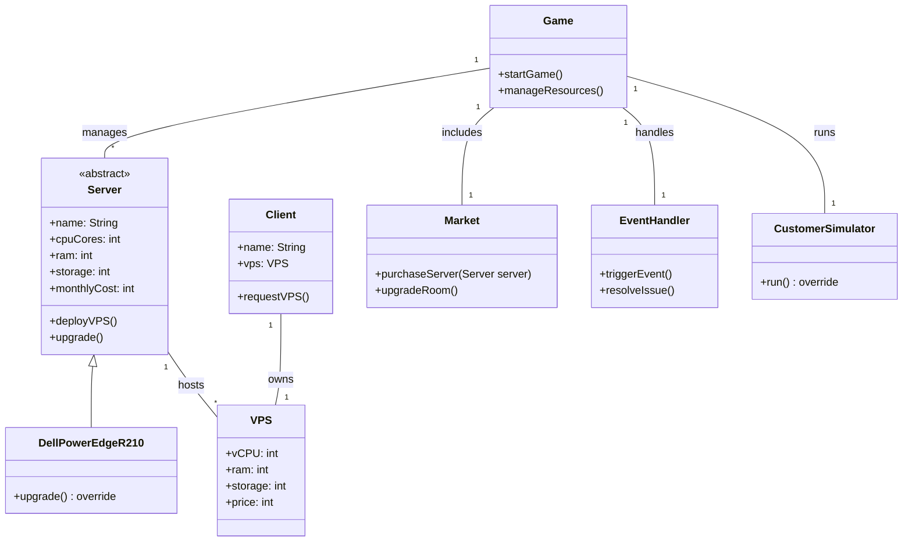

## **1) ภาพรวม (Game Overview)**

### **แนวเกม:**

- เกมแนว **Tycoon** ที่ให้ผู้เล่นบริหารธุรกิจ **VPS Hosting** ด้วยรูปแบบที่เข้าใจง่าย

### **เป้าหมายของเกม:**

1. **บริหารเซิร์ฟเวอร์**: ซื้อ, อัปเกรด, ดูแลเซิร์ฟเวอร์เพื่อรองรับลูกค้า VPS
2. **จัดการการเงิน**: รักษาสภาพคล่องทางการเงิน และทำกำไรให้ได้
3. **แก้ปัญหาแบบ Real-time**: เผชิญปัญหาสุ่ม เช่น Data Breach, VM Crash
4. **ขยายธุรกิจ**: อัปเกรดห้อง, ติดตั้ง Firewall, Router เพื่อรองรับลูกค้ารายใหญ่

### **กลไกหลักของเกม:**

- **การบริหารทรัพยากร**: วางแผนซื้อ/อัปเกรดเซิร์ฟเวอร์ และจัดการค่าใช้จ่าย
- **การตั้งค่า VPS Plans**: กำหนดแพ็กเกจ VPS เพื่อให้เหมาะสมกับตลาด
- **เหตุการณ์สุ่ม (Random Events)**: สร้างความท้าทายให้ผู้เล่น
- **การพัฒนาและขยายธุรกิจ**: ลงทุนเพิ่ม Firewall, Router, และอัปเกรดห้อง Server

---

## **2) การตั้งค่าเริ่มต้น (Starting Conditions)**

- **เงินเริ่มต้น**: 100,000 THB
- **เซิร์ฟเวอร์เริ่มต้น**: Dell PowerEdge R210 (4 Cores, 16GB RAM, 500GB HDD)
- **Overhead Cost**: 5,000 THB/เดือน (ค่าดำเนินการคงที่)
- **รอบเวลาในเกม**: 1 เดือน = 15 นาทีในเกม

---

## **3) โครงสร้างของเกม (Game Structure)**

### **3.1) เมนูหลัก (Main Menu)**

- **เริ่มเกมใหม่** (Start New Game)
- **โหลดเกม** (Load Game)
- **ตั้งค่าเกม** (Settings)
- **ออกจากเกม** (Exit)

### **3.2) ส่วนหลักของเกม**

1. **Dashboard**: แสดงข้อมูลภาพรวมของธุรกิจ (รายได้, ค่าใช้จ่าย, ความพึงพอใจของลูกค้า)
2. **Server Room**: จัดการ Rack Server (ซื้อ/อัปเกรด/ดูแล)
3. **Market**: ซื้ออุปกรณ์เพิ่มเติม เช่น Firewall, Router, อัปเกรดห้อง Server
4. **Client Management**: ดูคำสั่งซื้อ VPS จากลูกค้า และกำหนด VPS ให้พวกเขา
5. **Event Handling**: ระบบแจ้งเตือนปัญหาสุ่ม เช่น การโจมตีจาก Hacker, Server ล่ม

---

## **4) ระบบเซิร์ฟเวอร์ (Server System)**

### **ตารางเซิร์ฟเวอร์**

|**ชื่อเซิร์ฟเวอร์**|**ราคาซื้อ (บาท)**|**ค่าใช้จ่ายรายเดือน (บาท)**|**CPU Cores**|**RAM (GB)**|**Storage**|**Network Port**|
|---|---|---|---|---|---|---|
|Dell PowerEdge R210|20,000|2,000|4|16|500GB HDD|1 Gbps (Shared)|
|Dell PowerEdge R310|35,000|3,000|6|32|1TB HDD|1 Gbps (Shared)|
|Dell PowerEdge R410|50,000|4,000|8|64|1TB SSD|1 Gbps (Shared)|

---

## **5) ระบบมัลติเธรด (Multithreading System)**

### **การใช้งาน Multithreading ในเกม**

- **CustomerSimulator (Thread)**: จำลองลูกค้าที่สั่งซื้อ VPS
- **ServerMonitor (Thread)**: ตรวจสอบสถานะเซิร์ฟเวอร์และแจ้งเตือนปัญหา
- **EventProcessor (Thread)**: จัดการเหตุการณ์สุ่ม เช่น DDoS, ไฟดับ

### **ตัวอย่างโค้ด Multithreading**

```java
class CustomerSimulator extends Thread {
    public void run() {
        while (true) {
            System.out.println("ลูกค้าใหม่ขอเช่า VPS...");
            try {
                Thread.sleep(10000);
            } catch (InterruptedException e) {
                e.printStackTrace();
            }
        }
    }
}
```

---

## **6) แผนผังคลาส (Class Diagram - Java)**



---