# 🎮 VPS TYCOON

## 📋 สารบัญ

<hr />

- [🤝 วิธีการมีส่วนร่วม](#how-to-contribute)
- [📖 คู่มือการพัฒนา](#game-development-guide)
- [🎮 รายละเอียดเกม](#game-details)
- [⚙️ การติดตั้ง](#technical-setup)
- [✅ สิ่งที่ต้องทำ](#todo)

# How Contribute by Nong Claude Kung :
# VPS Tycoon - Game Development Guide

## โครงสร้างโปรเจค

โปรเจคนี้เป็นเกม Tycoon ที่พัฒนาด้วย JavaFX แบ่งเป็นแพ็คเกจหลักๆ ดังนี้:

### 1. com.vpstycoon
- `GameApplication.java` - คลาสหลักที่เริ่มต้นเกม จัดการ navigation ระหว่างหน้าต่างๆ

### 2. com.vpstycoon.config
- จัดการการตั้งค่าเกม เช่น ความละเอียดหน้าจอ, เสียง
- ใช้ Jackson สำหรับ serialize/deserialize ข้อมูล

### 3. com.vpstycoon.game
- ตัวเกมหลัก จัดการ game state และ objects ในเกม
- `GameManager.java` - จัดการสถานะเกม การเซฟ/โหลด
- `GameObject.java` - คลาสพื้นฐานสำหรับวัตถุในเกม

### 4. com.vpstycoon.ui
- ส่วน UI ทั้งหมด แบ่งเป็น:
  - menu/ - หน้าเมนูต่างๆ
  - settings/ - หน้าตั้งค่า
  - game/ - หน้าเล่นเกม

### 5. com.vpstycoon.event
- ระบบ Event Bus สำหรับการสื่อสารระหว่างคอมโพเนนต์

### 6. com.vpstycoon.audio
- จัดการเสียงเพลงและเอฟเฟค

## แนวทางการพัฒนา

1. **Model-View Pattern**
   - แยก logic ออกจาก UI ชัดเจน
   - ใช้ Properties และ Bindings ของ JavaFX

2. **Event-Driven Architecture**
   - ใช้ EventBus ลดการ coupling
   - แยก concerns ด้วย event handlers

3. **Config Management**
   - ใช้ JSON สำหรับบันทึกการตั้งค่า
   - รองรับการ hot-reload

4. **Resource Management**
   - จัดการ assets (ภาพ, เสียง) แบบ lazy loading
   - มีระบบ cache

## Tips สำหรับมือใหม่

1. เริ่มจากการทำความเข้าใจ `GameApplication.java`
2. ศึกษาการทำงานของ UI ใน package ui/
3. ดูตัวอย่างการสร้าง GameObject ใน game/
4. ทดลองเพิ่ม features ใหม่โดยดู pattern จากโค้ดที่มีอยู่

# ลายละเอียดเกม Flow game เจาะลึกมากขึ้น
---
## Main menu : New game, Continue , Setting ,Exit
    -New game สร้างเซฟเกมใหม่ ***หากมีเซฟแล้วต้องถาม For sure?***
    -Continue เล่นเกมต่อ ***หากไม่มีเซฟแล้วต้องแจ้งไป New game***
    -Setting Set Resolotion , Music , Credit , Tutorial คลิก
    -Exit ออกเกม
---

## Game play
---
### Development Points (แต้มการพัฒนา)
    แต้มการพัฒนา (Development Points) สามารถแบ่งการใช้งานออกเป็น 4 หมวดหลัก:
    -🔴 Deploy
    ลดเวลาการ Deploy VPS
    ปลดล็อค ระบบปฏิบัติการใหม่ๆ
    ได้รับแต้มจาก : ระหว่างการ Opitmize
    -🔵 Network
    เพิ่ม Bandwidth
    ลด Network Congestion (ป้องกันเครือข่ายหนาแน่น)
    ได้รับแต้มจาก : ระหว่างการปล่อยเช่า Vps
    -🟣 Security (ความปลอดภัย)
    ลดโอกาส Data Breach
    เพิ่มตัวเลือก Firewall ป้องกันการแฮ็กมากขึ้น
    ได้รับแต้มจาก : ระหว่างการแก้ไขปัญหาที่เข้ามา
    -🟢 Marketing (การตลาด)
    เพิ่มช่องทางการตลาด
    เพิ่มโอกาสได้รับ Rating สูงขึ้น
    เพิ่มจำนวน Request ที่ได้รับ
    ได้รับแต้มจาก : หลังการโปรโมท

### Tutorial สอนวิธีการเล่น (สอนรอบเดียวแค่ New game)
#### Two Options
    -สไลด์ Show รูปภาพวิธีเล่นให้ผู้เล่นเลื่อนเอง
    -Event คลิกเพื่อไปต่อ

### กดตัวคอมพิวเตอร์ขึ้น Interface Desktops

#### Chat
    -ดู Request ลูกค้า แสดง Rating ของบริษัทมุมบน
    -Request Chat มีเพดาห์ Level ที่ต้องปลดโดยใช้แต้ม Marketing
    -Level Chat ที่ต้องปลดเพื่อ รับลูกค้ามากขึ้น ประเภทลูกค้าดีขึ้น ความยากRequestที่ยากขึ้น อัพเกรด

#### ประเภทลูกค้า ระดับลูกค้า
    -ลูกค้าบุคคลทั่วไป , ลูกค้าบริษัทเล็ก กลาง ใหญ่
    -งานที่ Request ยากขึ้นต้อง Optimize Vps ให้ดีเหมาะกับประเภทงาน (แบบใช้ให้คุ้มค่าอะ)
    -ประเภทงานที่เน้นความเร็ว ปลอดภัย รองรับความเสถียร
    -Maketing Point เพิ่ม หาก 1. Rating ที่ได้ลูกค้าเยอะหลังสรุป 2. เพิ่มจากการที่รับลูกค้าแต่ละประเภท ได้ Point ต่างกัน

#### หลังรับงาน Request 
##### เฟส 1 การเตรียมเครื่องให้ลูกค้า Optimize เตรียม 5 ด้าน
    มีตัวเลือกให้ผู้เล่นเลือกเลย แล้วปลดล็อคจากค่า Point ด้าน Seculity Deploy หรือ การซื้อ
    -OS เลือกระบบปฏิบัติการให้เหมาะสมกับประเภทงาน มีคำอธิบายสั้นแนะนำ
    -Security เกี่ยวกับ Firewall การเข้ารหัสป้องกัน
    -Performance Tuning ทำให้ Vps เร็วขึ้น เสถียร
    -Back up & Restore การเก็บข้อมูล
    -Monitoring & Alerts
    ทุกตัวเลือกมีแบบไม่เลือกก็ได้เพื่อประหยัดงบ ยกเว้น OS
    Opitimize ดีถูกใจรับ Deploy

##### เฟส 2 รัน Event (เกิดปัญหา พวก secure firewall) การใช้งานเครื่อง Vps ของลูกค้า
    -ถ้า Opitimize มาเหมาะกับงานและดี จะป้องกันให้เกิด Event บัคน้อยลง
    -ถ้า Optimize มาน้อยหรือไม่เหมาะกับงานอาจเกิดบัคบ่อย
    -เมื่อเกิดบัค ระหว่างนั้นจะไม่ได้เงิน ต้องเข้าช่วงซ่อมระบบ
    -หากระหว่างการใช้งานเกิดบัคบ่อยส่งผลต่อ Rating
    -ระหว่างการใช้ลูกค้าค่า Point Security Network
    ***Event ที่เกิดได้ตามการ Opitimize***
    🛑 Data Breach – ข้อมูลรั่วไหลหากไม่มี Firewall ส่งผลให้ลูกค้าให้คะแนนต่ำลง ต้องติดตั้ง Firewall และอัปเกรด Security

    ⚡ ไฟดับ – เกิดขึ้นหากไม่มี UPS ทำให้ VPS ดับชั่วคราว ลูกค้าอาจยกเลิกบริการ ต้องซื้อ UPS หรือย้ายไป Co-location

    🌐 Network Congestion – ลูกค้ามากเกินไปทำให้ VPS ช้า ต้องอัปเกรด Bandwidth หรือ Load Balancer

    🛠️ ฮาร์ดแวร์พัง – เกิดขึ้นจากการใช้งานหนัก VPS ในเครื่องได้รับผลกระทบ ต้องซื้อเซิร์ฟเวอร์ใหม่หรือใช้ Backup

    💰 ลูกค้าร้องเรียนเรื่องราคา – ตั้งราคาสูงเกินไป อาจทำให้ลูกค้าหาย ต้องลดราคาหรือเพิ่มโปรโมชั่น

    🦠 การโจมตี DDoS – ทำให้เซิร์ฟเวอร์โหลดสูง อาจล่ม ต้องติดตั้ง DDoS Protection และ Load Balancer

    📉 การแข่งขันจากคู่แข่ง – มีคู่แข่งเสนอราคาถูกกว่า ทำให้ลูกค้าหาย ต้องอัปเกรดบริการหรือทำการตลาดเพิ่ม

    📦 ขาดสต็อก IP – IP Address ไม่พอ ลูกค้าต้องรอ ต้องซื้อ IP Block เพิ่ม

    🔄 ระบบทำงานผิดพลาด – Bug หรือ Glitch ทำให้ VPS ล่ม ต้อง Rollback ระบบหรืออัปเดตแพตช์แก้ไข

    🎉 โอกาสพิเศษ – ได้รับรีวิวดี ลูกค้าเพิ่มขึ้น หรือได้ส่วนลดจาก Market

    📍 การจัดการเหตุการณ์สุ่ม

    แจ้งเตือนใน Dashboard ให้ผู้เล่นเลือกแก้ไขปัญหา
    เหตุการณ์ต้องใช้เวลาต่างกันตาม Opitimize (ซ่อมฮาร์ดแวร์)

##### เฟส 3 สรุปผล
    -ค่า Point ที่ได้ทั้งหมด วัดจาก Market Deploy Security Network
    -ค่า Rating วัดจาก คำนวณจากบัค , ความเร็ว
    -Market Point วัดจาก การคำนวณจาก Rating
---
### Interface Desktops Market
##### ระบบตลาด upgrade

## Intellij Install
---

### กรณี download javaFX มาเองในเครื่อง

- ใส่ใน `VM OPTION` 
- ที่ `Run > Edit Configurations...` 
- กด `Modifly options...`

  ```
  --module-path "C:\javafx-sdk-23.0.2\lib" --add-modules javafx.controls,javafx.fxml
  ```
---

---

## **1) ภาพรวม (Game Overview)**

### **แนวเกม:**

- เกมแนว **Tycoon** ที่ให้ผู้เล่นบริหารธุรกิจ **VPS Hosting** ด้วยรูปแบบที่เข้าใจง่าย

### **เป้าหมายของเกม:**

1. **บริหารเซิร์ฟเวอร์**: ซื้อ, อัปเกรด, ดูแลเซิร์ฟเวอร์เพื่อรองรับลูกค้า VPS
2. **จัดการการเงิน**: รักษาสภาพคล่องทางการเงิน และทำกำไรให้ได้
3. **แก้ปัญหาแบบ Real-time**: เผชิญปัญหาสุ่ม เช่น Data Breach, VM Crash
4. **ขยายธุรกิจ**: อัปเกรดห้อง, ติดตั้ง Firewall, Router เพื่อรองรับลูกค้ารายใหญ่

### **กลไกหลักของเกม:**

- **การบริหารทรัพยากร**: วางแผนซื้อ/อัปเกรดเซิร์ฟเวอร์ และจัดการค่าใช้จ่าย
- **การตั้งค่า VPS Plans**: กำหนดแพ็กเกจ VPS เพื่อให้เหมาะสมกับตลาด
- **เหตุการณ์สุ่ม (Random Events)**: สร้างความท้าทายให้ผู้เล่น
- **การพัฒนาและขยายธุรกิจ**: ลงทุนเพิ่ม Firewall, Router, และอัปเกรดห้อง Server

---

## **2) การตั้งค่าเริ่มต้น (Starting Conditions)**

- **เงินเริ่มต้น**: 100,000 THB
- **เซิร์ฟเวอร์เริ่มต้น**: Dell PowerEdge R210 (4 Cores, 16GB RAM, 500GB HDD)
- **Overhead Cost**: 5,000 THB/เดือน (ค่าดำเนินการคงที่)
- **รอบเวลาในเกม**: 1 เดือน = 15 นาทีในเกม

---

## **3) โครงสร้างของเกม (Game Structure)**

### **3.1) เมนูหลัก (Main Menu)**

- **เริ่มเกมใหม่** (Start New Game)
- **โหลดเกม** (Load Game)
- **ตั้งค่าเกม** (Settings)
- **ออกจากเกม** (Exit)

### **3.2) ส่วนหลักของเกม**

1. **Dashboard**: แสดงข้อมูลภาพรวมของธุรกิจ (รายได้, ค่าใช้จ่าย, ความพึงพอใจของลูกค้า)
2. **Server Room**: จัดการ Rack Server (ซื้อ/อัปเกรด/ดูแล)
3. **Market**: ซื้ออุปกรณ์เพิ่มเติม เช่น Firewall, Router, อัปเกรดห้อง Server
4. **Client Management**: ดูคำสั่งซื้อ VPS จากลูกค้า และกำหนด VPS ให้พวกเขา
5. **Event Handling**: ระบบแจ้งเตือนปัญหาสุ่ม เช่น การโจมตีจาก Hacker, Server ล่ม

---

## **4) ระบบเซิร์ฟเวอร์ (Server System)**

### **ตารางเซิร์ฟเวอร์**

|**ชื่อเซิร์ฟเวอร์**|**ราคาซื้อ (บาท)**|**ค่าใช้จ่ายรายเดือน (บาท)**|**CPU Cores**|**RAM (GB)**|**Storage**|**Network Port**|
|---|---|---|---|---|---|---|
|Dell PowerEdge R210|20,000|2,000|4|16|500GB HDD|1 Gbps (Shared)|
|Dell PowerEdge R310|35,000|3,000|6|32|1TB HDD|1 Gbps (Shared)|
|Dell PowerEdge R410|50,000|4,000|8|64|1TB SSD|1 Gbps (Shared)|

---

## **5) ระบบมัลติเธรด (Multithreading System)**

### **การใช้งาน Multithreading ในเกม**

- **CustomerSimulator (Thread)**: จำลองลูกค้าที่สั่งซื้อ VPS
- **ServerMonitor (Thread)**: ตรวจสอบสถานะเซิร์ฟเวอร์และแจ้งเตือนปัญหา
- **EventProcessor (Thread)**: จัดการเหตุการณ์สุ่ม เช่น DDoS, ไฟดับ

### **ตัวอย่างโค้ด Multithreading**

```java
class CustomerSimulator extends Thread {
    public void run() {
        while (true) {
            System.out.println("ลูกค้าใหม่ขอเช่า VPS...");
            try {
                Thread.sleep(10000);
            } catch (InterruptedException e) {
                e.printStackTrace();
            }
        }
    }
}
```

---

## **6) แผนผังคลาส (Class Diagram - Java)**

```mermaid
classDiagram
direction BT
class AudioManager {
- double sfxVolume
- double musicVolume
- AudioManager instance
- Map~String, Media~ soundCache
- MediaPlayer musicPlayer
+ playMusic(String) void
+ setMusicVolume(double) void
+ playSoundEffect(String) void
+ setSfxVolume(double) void
+ dispose() void
+ getInstance() AudioManager
- onSettingsChanged(SettingsChangedEvent) void
  }
  class ConfigSerializer {
- ObjectMapper mapper
- String CONFIG_FILE
+ saveToFile(GameConfig) void
+ loadFromFile() GameConfig
  }
  class DefaultGameConfig {
- double sfxVolume
- double musicVolume
- boolean vsyncEnabled
- boolean isFullscreen
- DefaultGameConfig instance
- ScreenResolution selectedResolution
+ getResolution() ScreenResolution
+ setFullscreen(boolean) void
+ getInstance() DefaultGameConfig
+ setVsyncEnabled(boolean) void
+ isFullscreen() boolean
+ setResolution(ScreenResolution) void
+ save() void
+ getMusicVolume() double
+ load() void
+ getSfxVolume() double
+ isVsyncEnabled() boolean
+ setMusicVolume(double) void
+ setSfxVolume(double) void
  }
  class EventListener~T~ {
  <<Interface>>
+ onEvent(T) void
  }
  class GameApplication {
- ScreenManager screenManager
- Stage primaryStage
- GameplayScreen gameplayScreen
- GameManager gameManager
- MainMenuScreen mainMenuScreen
- PlayMenuScreen playMenuScreen
- GameConfig gameConfig
- GameSaveManager saveManager
- SettingsScreen settingsScreen
- loadGameState(GameState) void
- createGameConfig() GameConfig
- createScreens() void
+ showMainMenu() void
+ showSettings() void
+ main(String[]) void
+ startNewGame() void
+ continueGame() void
- shutdown() void
- initializeGame() void
- startGame(GameState) void
+ showPlayMenu() void
+ showLoadGame() void
- showAlert(String, String) void
+ start(Stage) void
  }
  class GameConfig {
  <<Interface>>
+ setResolution(ScreenResolution) void
+ setFullscreen(boolean) void
+ load() void
+ isVsyncEnabled() boolean
+ setMusicVolume(double) void
+ save() void
+ getMusicVolume() double
+ getSfxVolume() double
+ getResolution() ScreenResolution
+ setSfxVolume(double) void
+ setVsyncEnabled(boolean) void
+ isFullscreen() boolean
  }
  class GameEventBus {
- Map~Class~?~, List~EventListener~?~~~ listeners
- GameEventBus instance
+ unsubscribe(Class~T~, EventListener~T~) void
+ subscribe(Class~T~, EventListener~T~) void
+ getInstance() GameEventBus
+ publish(T) void
  }
  class GameManager {
- ObjectMapper objectMapper
- GameManager instance
- String SAVE_FILE
- GameState currentState
+ getInstance() GameManager
+ loadState(GameState) void
+ getCurrentState() GameState
+ hasSavedGame() boolean
+ saveState() void
+ loadSavedState() GameState
+ deleteSavedGame() void
  }
  class GameObject {
- String type
- String id
- boolean active
- String status
- double x
- long serialVersionUID
- Map~String, Object~ properties
- int level
- double y
- String name
+ getId() String
+ getY() double
+ getProperty(String) Object
+ upgrade(GameState) void
+ getStatus() String
+ getProperties() Map~String, Object~
+ setActive(boolean) void
+ getName() String
+ getLevel() int
+ setY(double) void
+ getX() double
+ setProperty(String, Object) void
+ setX(double) void
+ setStatus(String) void
+ getType() String
+ isActive() boolean
+ setName(String) void
+ setLevel(int) void
  }
  class GameObjectView {
- Rectangle background
- GameObject gameObject
  }
  class GameSaveManager {
- String BACKUP_DIR
- ObjectMapper mapper
- String SAVE_FILE
- createCorruptedFileBackup(File) void
+ saveGame(GameState) void
- createBackupDirectory() void
+ saveExists() boolean
- createBackup() void
+ deleteGame() void
+ loadGame() GameState
  }
  class GameScreen {
# ScreenManager screenManager
# GameConfig config
+ show() void
# enforceResolution(Region) void
# createContent() Region
}
class GameScreen {
- GameConfig gameConfig
- GameState gameState
- Navigator navigator
- initializeUI() void
  }
  class GameState {
- Map~String, Integer~ resources
- long serialVersionUID
- List~GameObject~ gameObjects
- long lastSaveTime
- long money
- Map~String, Boolean~ upgrades
+ getGameObjects() List~GameObject~
+ setLastSaveTime(long) void
+ getUpgrades() Map~String, Boolean~
+ getMoney() long
+ getLastSaveTime() long
+ removeGameObject(GameObject) void
+ setMoney(long) void
+ addGameObject(GameObject) void
+ getResources() Map~String, Integer~
+ setGameObjects(List~GameObject~) void
  }
  class GameplayScreen {
- List~GameObject~ gameObjects
- StackPane gameArea
- Navigator navigator
- GameSaveManager saveManager
- showConfirmationDialog(String, String, Runnable) void
- loadGame() void
# createContent() Region
- showObjectDetails(GameObject) void
- initializeGameObjects() void
- createModalButton(String) Button
- createButton(String) Button
- saveGame() void
  }
  class JavaFXScreenManager {
- Stage stage
- GameConfig config
+ setResolution(ScreenResolution) void
+ setFullscreen(boolean) void
+ applySettings(Stage, Scene) void
+ switchScreen(Node) void
  }
  class MainMenuScreen {
- double BUTTON_WIDTH
- double BUTTON_HEIGHT
- PlayMenuScreen playMenuScreen
- SettingsScreen settingsScreen
- Navigator navigator
+ setPlayMenuScreen(PlayMenuScreen) void
# createContent() Region
+ setSettingsScreen(SettingsScreen) void
  }
  class MenuButton {
- double WIDTH
- double HEIGHT
- MenuButtonType type
- render() void
- neon() Effect
  }
  class MenuButtonType {
  <<enumeration>>
+  SETTINGS
+  NEW_GAME
+  QUIT
+  PLAY
+  APPLY
+  DELETEGAME
+  BACK
- String value
+  CONTINUE
+ values() MenuButtonType[]
+ valueOf(String) MenuButtonType
+ getValue() String
  }
  class Navigator {
  <<Interface>>
+ showMainMenu() void
+ showPlayMenu() void
+ startNewGame() void
+ showLoadGame() void
+ showSettings() void
+ continueGame() void
  }
  class PlayMenuScreen {
- Button continueButton
- StackPane root
- String SAVE_FILE
- GameSaveManager saveManager
- double SPACING
- Navigator navigator
# createContent() Region
- continueGame() void
- saveGameExists() boolean
+ refreshContinueButton() void
- showNewGameConfirmation() void
- startNewGame() void
  }
  class ResourceManager {
- Map~String, Image~ imageCache
- ResourceManager instance
- String TEXT_PATH
- String MUSIC_PATH
- Map~String, String~ textCache
- String SOUNDS_PATH
- String IMAGES_PATH
+ getImagePath(String) String
+ getSoundPath(String) String
+ loadImage(String) Image
+ getTextPath(String) String
+ getResourceAsStream(String) InputStream
+ getText(String) String
+ clearCache() void
+ getMusicPath(String) String
+ getResource(String) URL
+ getInstance() ResourceManager
  }
  class SceneController {
- SceneController instance
- Scene mainScene
- ScreenManager screenManager
- StackPane rootContainer
- Stage stage
- GameConfig config
+ getInstance() SceneController
- initializeScene() void
+ setContent(Parent) void
+ initialize(Stage, GameConfig, ScreenManager) void
+ updateResolution() void
  }
  class ScreenManager {
  <<Interface>>
+ setFullscreen(boolean) void
+ switchScreen(Node) void
+ setResolution(ScreenResolution) void
+ applySettings(Stage, Scene) void
  }
  class ScreenResolution {
  <<enumeration>>
+  RES_3440x1440
- String displayName
+  RES_1600x900
+  RES_2560x1440
+  RES_1920x1080
- int height
+  RES_1280x720
+  RES_1366x768
+  RES_3840x2160
+  RES_2048x1152
- int width
+ getHeight() int
+ getMaxSupportedResolution() ScreenResolution
+ values() ScreenResolution[]
+ getWidth() int
+ valueOf(String) ScreenResolution
+ toString() String
  }
  class SettingsChangedEvent {
- GameConfig newConfig
+ getNewConfig() GameConfig
  }
  class SettingsScreen {
- Slider sfxVolumeSlider
- CheckBox vsyncCheckBox
- Slider musicVolumeSlider
- CheckBox fullscreenCheckBox
- Navigator navigator
- ComboBox~ScreenResolution~ resolutionComboBox
- createTitleLabel(String) Label
- createSliderControl(String, double, SliderInitializer) HBox
- createStyledCheckBox(CheckBox) CheckBox
- createSettingsContainer() VBox
- createLabeledControl(String, Control) HBox
# createContent() Region
- createSectionLabel(String) Label
- createBackButton() MenuButton
- createVolumeControls() VBox
- createApplyButton() MenuButton
- createDisplayControls() VBox
  }
  class SettingsViewModel {
- ObjectProperty~ScreenResolution~ resolution
- DoubleProperty musicVolume
- BooleanProperty fullscreen
- DoubleProperty sfxVolume
- GameConfig config
- BooleanProperty vsync
- setupBindings() void
+ musicVolumeProperty() DoubleProperty
+ resolutionProperty() ObjectProperty~ScreenResolution~
+ sfxVolumeProperty() DoubleProperty
+ vsyncProperty() BooleanProperty
+ saveSettings() void
+ fullscreenProperty() BooleanProperty
- showErrorDialog(String) void
  }
  class VPSObject {
+ upgrade(GameState) void
- calculateUpgradeCost() long
  }

DefaultGameConfig  ..>  GameConfig
GameApplication  ..>  Navigator
GameplayScreen  -->  GameScreen
JavaFXScreenManager  ..>  ScreenManager
MainMenuScreen  -->  GameScreen
SettingsScreen  -->  GameScreen
VPSObject  -->  GameObject

```



---

## ToDo
- [x] Main Menu
- [x] Pause Menu
    - [x] New Game btn
    - [x] Resume btn
- [x] Setting Screen
    - [x] Resolution
    - [x] Fullscreen 
- [x] Empty Screen


